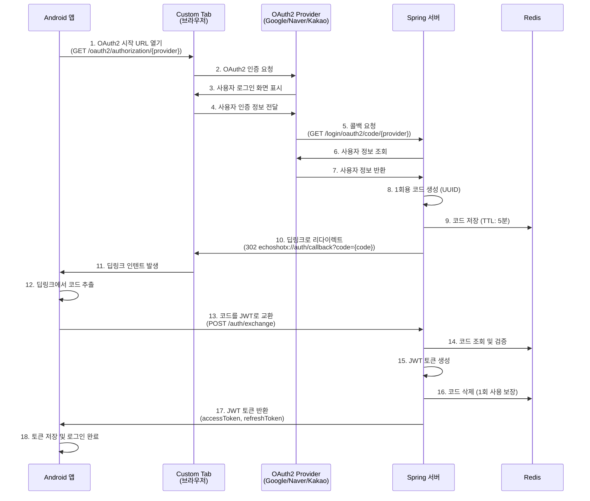

# Android 소셜 로그인 구현 가이드

## 개요

이 문서는 EchoShotX 백엔드 서버와 연동하여 Android 앱에서 소셜 로그인(Google, Naver, Kakao)을 구현하는 방법을 설명합니다. 서버는 OAuth2 인증 플로우를 통해 1회용 인증 코드를 생성하고, 이를 딥링크로 전달하며, 이후 앱에서 코드를 JWT 토큰으로 교환하는 방식으로 동작합니다.

## 인증 플로우 다이어그램



## 서버 엔드포인트

### 1. OAuth2 시작 엔드포인트

소셜 로그인을 시작하기 위한 엔드포인트입니다. 브라우저(Custom Tab)에서 이 URL을 열어야 합니다.

**엔드포인트:**
- Google: `GET {BASE_URL}/oauth2/authorization/google`
- Naver: `GET {BASE_URL}/oauth2/authorization/naver`
- Kakao: `GET {BASE_URL}/oauth2/authorization/kakao`

**예시:**
```
https://your-server.com/oauth2/authorization/google
https://your-server.com/oauth2/authorization/naver
https://your-server.com/oauth2/authorization/kakao
```

### 2. 코드 교환 엔드포인트

딥링크로 받은 1회용 코드를 JWT 토큰으로 교환하는 엔드포인트입니다.

**엔드포인트:** `POST {BASE_URL}/auth/exchange`

**Request Body:**
```json
{
  "code": "1회용 인증 코드 (UUID)"
}
```

**Response:**
```json
{
  "isSuccess": true,
  "code": 2000,
  "message": "성공",
  "result": {
    "accessToken": "eyJhbGciOiJIUzI1NiIsInR5cCI6IkpXVCJ9...",
    "refreshToken": "eyJhbGciOiJIUzI1NiIsInR5cCI6IkpXVCJ9...",
    "expiresIn": 1800
  }
}
```

**에러 응답 예시:**
```json
{
  "isSuccess": false,
  "code": 4058,
  "message": "유효하지 않은 인증 코드입니다.",
  "result": null
}
```

**에러 코드:**
- `4058`: 유효하지 않은 인증 코드 (AUTH_CODE_INVALID)
- `4059`: 인증 코드가 만료되었습니다 (AUTH_CODE_EXPIRED)
- `4060`: 이미 사용된 인증 코드입니다 (AUTH_CODE_ALREADY_USED)

## Android 구현 단계

### 1. 프로젝트 설정

#### 1.1 Gradle 의존성 추가

`app/build.gradle.kts` 또는 `app/build.gradle`에 다음 의존성을 추가합니다:

```kotlin
dependencies {
    // Retrofit for HTTP requests
    implementation("com.squareup.retrofit2:retrofit:2.9.0")
    implementation("com.squareup.retrofit2:converter-gson:2.9.0")
    
    // OkHttp for HTTP client
    implementation("com.squareup.okhttp3:okhttp:4.12.0")
    implementation("com.squareup.okhttp3:logging-interceptor:4.12.0")
    
    // AndroidX Browser (Custom Tabs)
    implementation("androidx.browser:browser:1.7.0")
    
    // Coroutines
    implementation("org.jetbrains.kotlinx:kotlinx-coroutines-android:1.7.3")
    
    // Lifecycle components
    implementation("androidx.lifecycle:lifecycle-viewmodel-ktx:2.7.0")
    implementation("androidx.lifecycle:lifecycle-runtime-ktx:2.7.0")
}
```

#### 1.2 AndroidManifest.xml 설정

**딥링크 인텐트 필터 추가:**

`app/src/main/AndroidManifest.xml` 파일에 딥링크 처리를 위한 인텐트 필터를 추가합니다:

```xml
<activity
    android:name=".ui.auth.AuthCallbackActivity"
    android:exported="true"
    android:launchMode="singleTop">
    <intent-filter>
        <action android:name="android.intent.action.VIEW" />
        <category android:name="android.intent.category.DEFAULT" />
        <category android:name="android.intent.category.BROWSABLE" />
        
        <!-- 딥링크 스킴 설정 (서버의 auth.deep-link-scheme 값과 일치해야 함) -->
        <data
            android:scheme="echoshotx"
            android:host="auth"
            android:pathPrefix="/callback" />
    </intent-filter>
</activity>
```

**인터넷 권한 확인:**

```xml
<uses-permission android:name="android.permission.INTERNET" />
```

### 2. 데이터 모델 정의

#### 2.1 AuthExchangeRequest

```kotlin
data class AuthExchangeRequest(
    val code: String
)
```

#### 2.2 AuthExchangeResponse

```kotlin
data class AuthExchangeResponse(
    val accessToken: String,
    val refreshToken: String,
    val expiresIn: Int  // 초 단위 (기본값: 1800 = 30분)
)
```

#### 2.3 ApiResponseDto

서버의 응답 구조에 맞춘 래퍼 클래스:

```kotlin
data class ApiResponseDto<T>(
    val isSuccess: Boolean,
    val code: Int,
    val message: String,
    val result: T?
)
```

### 3. Retrofit API 인터페이스

```kotlin
import retrofit2.http.Body
import retrofit2.http.POST

interface AuthApiService {
    @POST("/auth/exchange")
    suspend fun exchangeCode(
        @Body request: AuthExchangeRequest
    ): ApiResponseDto<AuthExchangeResponse>
}
```

### 4. Retrofit 클라이언트 설정

```kotlin
import okhttp3.OkHttpClient
import okhttp3.logging.HttpLoggingInterceptor
import retrofit2.Retrofit
import retrofit2.converter.gson.GsonConverterFactory
import java.util.concurrent.TimeUnit

object RetrofitClient {
    private const val BASE_URL = "https://your-server.com"  // 실제 서버 주소로 변경
    
    private val loggingInterceptor = HttpLoggingInterceptor().apply {
        level = HttpLoggingInterceptor.Level.BODY
    }
    
    private val okHttpClient = OkHttpClient.Builder()
        .addInterceptor(loggingInterceptor)
        .connectTimeout(30, TimeUnit.SECONDS)
        .readTimeout(30, TimeUnit.SECONDS)
        .writeTimeout(30, TimeUnit.SECONDS)
        .build()
    
    private val retrofit = Retrofit.Builder()
        .baseUrl(BASE_URL)
        .client(okHttpClient)
        .addConverterFactory(GsonConverterFactory.create())
        .build()
    
    val authApi: AuthApiService = retrofit.create(AuthApiService::class.java)
}
```

### 5. 토큰 관리 클래스

```kotlin
import android.content.Context
import android.content.SharedPreferences

class TokenManager(context: Context) {
    private val prefs: SharedPreferences = 
        context.getSharedPreferences("auth_prefs", Context.MODE_PRIVATE)
    
    companion object {
        private const val KEY_ACCESS_TOKEN = "access_token"
        private const val KEY_REFRESH_TOKEN = "refresh_token"
    }
    
    fun saveTokens(accessToken: String, refreshToken: String) {
        prefs.edit()
            .putString(KEY_ACCESS_TOKEN, accessToken)
            .putString(KEY_REFRESH_TOKEN, refreshToken)
            .apply()
    }
    
    fun getAccessToken(): String? = prefs.getString(KEY_ACCESS_TOKEN, null)
    
    fun getRefreshToken(): String? = prefs.getString(KEY_REFRESH_TOKEN, null)
    
    fun clearTokens() {
        prefs.edit()
            .remove(KEY_ACCESS_TOKEN)
            .remove(KEY_REFRESH_TOKEN)
            .apply()
    }
    
    fun isLoggedIn(): Boolean = getAccessToken() != null
}
```

### 6. 소셜 로그인 시작 로직

```kotlin
import androidx.browser.customtabs.CustomTabsIntent
import android.net.Uri

class AuthRepository(private val context: Context) {
    private val authApi = RetrofitClient.authApi
    
    companion object {
        private const val BASE_URL = "https://your-server.com"
        private const val GOOGLE_OAUTH_URL = "$BASE_URL/oauth2/authorization/google"
        private const val NAVER_OAUTH_URL = "$BASE_URL/oauth2/authorization/naver"
        private const val KAKAO_OAUTH_URL = "$BASE_URL/oauth2/authorization/kakao"
    }
    
    /**
     * 소셜 로그인을 시작합니다.
     * Custom Tab을 통해 OAuth2 인증 URL을 엽니다.
     */
    fun startSocialLogin(provider: SocialProvider) {
        val url = when (provider) {
            SocialProvider.GOOGLE -> GOOGLE_OAUTH_URL
            SocialProvider.NAVER -> NAVER_OAUTH_URL
            SocialProvider.KAKAO -> KAKAO_OAUTH_URL
        }
        
        val customTabsIntent = CustomTabsIntent.Builder()
            .setShowTitle(true)
            .build()
        
        customTabsIntent.launchUrl(context, Uri.parse(url))
    }
    
    enum class SocialProvider {
        GOOGLE, NAVER, KAKAO
    }
}
```

### 7. 딥링크 콜백 처리

#### 7.1 AuthCallbackActivity

```kotlin
import android.content.Intent
import android.net.Uri
import android.os.Bundle
import androidx.appcompat.app.AppCompatActivity
import androidx.lifecycle.lifecycleScope
import kotlinx.coroutines.launch

class AuthCallbackActivity : AppCompatActivity() {
    
    private lateinit var authRepository: AuthRepository
    private lateinit var tokenManager: TokenManager
    
    override fun onCreate(savedInstanceState: Bundle?) {
        super.onCreate(savedInstanceState)
        
        authRepository = AuthRepository(this)
        tokenManager = TokenManager(this)
        
        handleDeepLink(intent)
    }
    
    override fun onNewIntent(intent: Intent) {
        super.onNewIntent(intent)
        setIntent(intent)
        handleDeepLink(intent)
    }
    
    private fun handleDeepLink(intent: Intent) {
        val uri: Uri? = intent.data
        
        if (uri != null && uri.scheme == "echoshotx" && uri.host == "auth") {
            val code = uri.getQueryParameter("code")
            
            if (code != null) {
                exchangeCode(code)
            } else {
                // 코드가 없는 경우 에러 처리
                handleError("인증 코드가 없습니다.")
            }
        } else {
            handleError("잘못된 딥링크입니다.")
        }
    }
    
    private fun exchangeCode(code: String) {
        lifecycleScope.launch {
            try {
                val response = authRepository.exchangeCode(code)
                
                if (response.isSuccess && response.result != null) {
                    val tokens = response.result!!
                    tokenManager.saveTokens(
                        tokens.accessToken,
                        tokens.refreshToken
                    )
                    
                    // 로그인 성공 처리 (예: 메인 화면으로 이동)
                    navigateToMain()
                } else {
                    // 서버 에러 응답 처리
                    handleError(response.message ?: "인증 실패")
                }
            } catch (e: Exception) {
                // 네트워크 에러 등 예외 처리
                handleError("네트워크 오류가 발생했습니다: ${e.message}")
            }
        }
    }
    
    private fun navigateToMain() {
        val intent = Intent(this, MainActivity::class.java).apply {
            flags = Intent.FLAG_ACTIVITY_NEW_TASK or Intent.FLAG_ACTIVITY_CLEAR_TASK
        }
        startActivity(intent)
        finish()
    }
    
    private fun handleError(message: String) {
        // 에러 처리 (예: 에러 메시지 표시 또는 로그인 화면으로 복귀)
        val intent = Intent(this, LoginActivity::class.java).apply {
            flags = Intent.FLAG_ACTIVITY_NEW_TASK or Intent.FLAG_ACTIVITY_CLEAR_TASK
            putExtra("error_message", message)
        }
        startActivity(intent)
        finish()
    }
}
```

#### 7.2 AuthRepository에 exchangeCode 메서드 추가

```kotlin
class AuthRepository(private val context: Context) {
    private val authApi = RetrofitClient.authApi
    
    suspend fun exchangeCode(code: String): ApiResponseDto<AuthExchangeResponse> {
        return authApi.exchangeCode(AuthExchangeRequest(code))
    }
    
    // ... 기존 코드 ...
}
```

### 8. 로그인 화면 구현 예시

```kotlin
import android.content.Intent
import android.os.Bundle
import androidx.appcompat.app.AppCompatActivity
import androidx.lifecycle.ViewModelProvider

class LoginActivity : AppCompatActivity() {
    
    private lateinit var viewModel: LoginViewModel
    private lateinit var tokenManager: TokenManager
    
    override fun onCreate(savedInstanceState: Bundle?) {
        super.onCreate(savedInstanceState)
        setContentView(R.layout.activity_login)
        
        tokenManager = TokenManager(this)
        
        // 이미 로그인된 경우 메인 화면으로 이동
        if (tokenManager.isLoggedIn()) {
            navigateToMain()
            return
        }
        
        viewModel = ViewModelProvider(this)[LoginViewModel::class.java]
        
        // 에러 메시지 처리
        intent.getStringExtra("error_message")?.let { errorMessage ->
            showError(errorMessage)
        }
        
        setupClickListeners()
    }
    
    private fun setupClickListeners() {
        findViewById<Button>(R.id.btn_google_login).setOnClickListener {
            viewModel.startGoogleLogin()
        }
        
        findViewById<Button>(R.id.btn_naver_login).setOnClickListener {
            viewModel.startNaverLogin()
        }
        
        findViewById<Button>(R.id.btn_kakao_login).setOnClickListener {
            viewModel.startKakaoLogin()
        }
    }
    
    private fun navigateToMain() {
        val intent = Intent(this, MainActivity::class.java)
        startActivity(intent)
        finish()
    }
    
    private fun showError(message: String) {
        // 에러 메시지 표시 (Toast, Snackbar 등)
        Toast.makeText(this, message, Toast.LENGTH_LONG).show()
    }
}
```

#### 8.1 LoginViewModel

```kotlin
import androidx.lifecycle.ViewModel
import androidx.lifecycle.viewModelScope

class LoginViewModel(private val authRepository: AuthRepository) : ViewModel() {
    
    fun startGoogleLogin() {
        authRepository.startSocialLogin(AuthRepository.SocialProvider.GOOGLE)
    }
    
    fun startNaverLogin() {
        authRepository.startSocialLogin(AuthRepository.SocialProvider.NAVER)
    }
    
    fun startKakaoLogin() {
        authRepository.startSocialLogin(AuthRepository.SocialProvider.KAKAO)
    }
}
```

### 9. API 호출 시 토큰 사용

이후 API 호출 시 저장된 액세스 토큰을 사용하려면, OkHttp Interceptor를 추가합니다:

```kotlin
class AuthInterceptor(private val tokenManager: TokenManager) : Interceptor {
    override fun intercept(chain: Interceptor.Chain): Response {
        val request = chain.request()
        val accessToken = tokenManager.getAccessToken()
        
        val authenticatedRequest = if (accessToken != null) {
            request.newBuilder()
                .header("Authorization", "Bearer $accessToken")
                .build()
        } else {
            request
        }
        
        return chain.proceed(authenticatedRequest)
    }
}
```

Retrofit 클라이언트에 인터셉터 추가:

```kotlin
object RetrofitClient {
    // ... 기존 코드 ...
    
    fun createAuthenticatedClient(tokenManager: TokenManager): Retrofit {
        val authInterceptor = AuthInterceptor(tokenManager)
        
        val okHttpClient = OkHttpClient.Builder()
            .addInterceptor(loggingInterceptor)
            .addInterceptor(authInterceptor)  // 인증 인터셉터 추가
            .connectTimeout(30, TimeUnit.SECONDS)
            .readTimeout(30, TimeUnit.SECONDS)
            .writeTimeout(30, TimeUnit.SECONDS)
            .build()
        
        return Retrofit.Builder()
            .baseUrl(BASE_URL)
            .client(okHttpClient)
            .addConverterFactory(GsonConverterFactory.create())
            .build()
    }
}
```

## 주요 고려사항

### 1. 보안

- **토큰 저장**: 액세스 토큰과 리프레시 토큰은 `SharedPreferences`의 암호화된 저장소나 Android Keystore를 사용하는 것을 권장합니다.
- **HTTPS 필수**: 모든 통신은 HTTPS를 사용해야 합니다.
- **코드 만료 시간**: 서버에서 설정한 코드 TTL(기본 5분) 내에 코드를 교환해야 합니다.

### 2. 에러 처리

다음 상황에 대한 에러 처리를 구현해야 합니다:
- 네트워크 오류
- 인증 코드 만료 (4059)
- 유효하지 않은 코드 (4058)
- 이미 사용된 코드 (4060)
- 서버 오류 (500번대)

### 3. 딥링크 처리

- `launchMode="singleTop"`으로 설정하여 동일한 Activity가 여러 번 생성되지 않도록 합니다.
- `onNewIntent()`를 오버라이드하여 새로운 딥링크 인텐트를 처리합니다.

### 4. Custom Tabs

- Custom Tabs를 사용하여 OAuth2 인증을 수행하면, 사용자 경험이 향상되고 앱 내에서 일관된 UI를 제공할 수 있습니다.
- Custom Tabs가 지원되지 않는 경우 기본 브라우저로 폴백 처리합니다.

### 5. 상태 관리

- 로그인 상태는 `TokenManager`를 통해 관리하며, 앱 시작 시 자동으로 로그인 상태를 확인합니다.
- 로그아웃 시 토큰을 삭제하고 로그인 화면으로 이동합니다.

## 테스트 체크리스트

- [ ] 각 소셜 로그인 제공자(Google, Naver, Kakao)별 로그인 플로우 테스트
- [ ] 딥링크를 통한 코드 수신 및 파싱 테스트
- [ ] 코드 교환 API 호출 성공 케이스 테스트
- [ ] 코드 만료 시나리오 테스트 (5분 후)
- [ ] 잘못된 코드로 교환 시도 시 에러 처리 테스트
- [ ] 네트워크 오류 상황 테스트
- [ ] 이미 로그인된 상태에서 앱 재시작 시 자동 로그인 확인
- [ ] 로그아웃 기능 테스트

## 서버 설정 확인사항

Android 앱 구현 전에 다음 서버 설정을 확인하세요:

1. **OAuth2 콜백 URL 등록**: 각 소셜 로그인 제공자 콘솔에 서버의 콜백 URL이 등록되어 있어야 합니다.
   - Google: `{BASE_URL}/login/oauth2/code/google`
   - Naver: `{BASE_URL}/login/oauth2/code/naver`
   - Kakao: `{BASE_URL}/login/oauth2/code/kakao`

2. **딥링크 스킴**: `application.yml`의 `auth.deep-link-scheme` 값이 `echoshotx`로 설정되어 있는지 확인합니다.

3. **코드 TTL**: `auth.code-ttl-seconds` 값(기본 300초 = 5분)을 확인합니다.

4. **CORS 설정**: API 호출 시 CORS 이슈가 없는지 확인합니다 (앱은 일반적으로 CORS의 영향을 받지 않지만, 개발 중 웹뷰 사용 시 필요할 수 있습니다).

## 참고 자료

- [Android Custom Tabs](https://developer.android.com/reference/androidx/browser/customtabs/package-summary)
- [Android Deep Links](https://developer.android.com/training/app-links/deep-linking)
- [Retrofit Documentation](https://square.github.io/retrofit/)
- [OkHttp Documentation](https://square.github.io/okhttp/)

